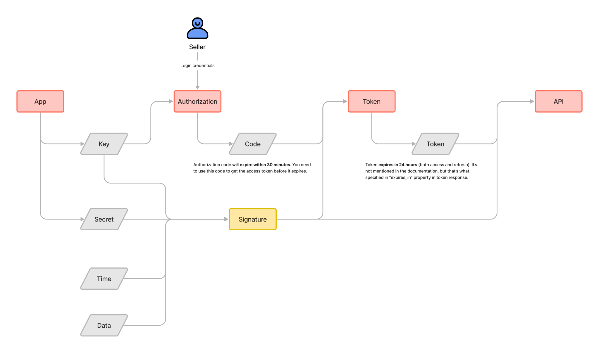

# Alibaba API Workflow

To be able to interact with Alibaba Open Platform, you need to follow the steps below:
1. [Create the application](https://openapi.alibaba.com/app/index.htm?spm=a2o9m.11193487.0.0.35b913a0AlGs39#/app/create?_k=lrqyds) 
on the [Alibaba Open Platform](https://openapi.alibaba.com/) specifying all the required permissions (app category).  
This may require you to have an Alibaba account and company verification process to be complete.
2. Obtain the `app-key` and `app-secret` from the created application.  
This is available in the application settings after Alibaba approves the application.
3. Authorize the application to access the seller data.  
Use the [`Facade::getAuthorizationUrl`](../src/Facade.php#L53) method to get the URL to authorize the application.
This will require to log in as a seller and grant the permissions to the application.
As a result, you will be redirected to callback URL with the authorization code.
4. Obtain the `access-token` from the authorization response.
Use the [`Facade::token->new`](../src/Endpoint/TokenEndpoint.php#L39) method to get the `access-token` (and `refresh-token`).
5. Use the `access-token` to interact with the Alibaba Open Platform.

> Every request to the Alibaba Open Platform requires the `access-token` and valid `signature`.
> Signature is a hash of the `app-key`, `app-secret`, `timestamp` and `request payload`.
> Signature is generated by the SDK automatically.

See the following schema for the Alibaba API workflow:

For more details see the Alibaba Open Platform [quick start guide](https://openapi.alibaba.com/doc/doc.htm?spm=a2o9m.11223882.0.0.1566722cTOuz7W#/?docId=51).
